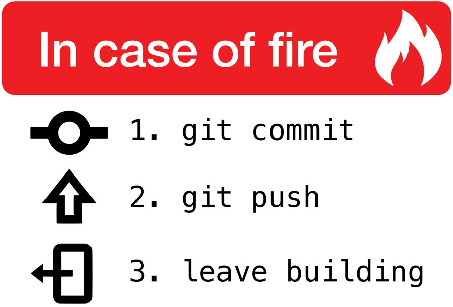

<h4 align="center">always, <em>always</em> have a plan</h4>

***

<h4 align="center">general tools & software</h4>

 
   
   
  
  
   
   
   

<h4 align="center">data analytics & statistics</h4>

 
   
   
   
   
   
   
   
   
   

<h4 align="center">ai/ml/dl</h4>

 
  
   
   
   

<h4 align="center">dev ops</h4>

 
   
   
   
  
  
  

***

<h4 align="center">github stats</h4>

  

